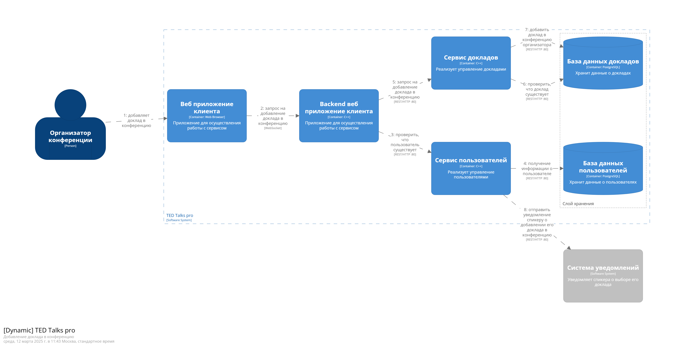

# Домашнее задание №1 по курсу «программная инженерия»

Речинская Ангелина М8О-106СВ-24 Вариант №3

Необходимо создать описание архитектуры системы в формате Structurizr DSL по плану:
## 1. Изучите текст задания.
Сайт конференции https://www.eventboost.com/ru-RU/

Приложение должно содержать следующие данные:
- Пользователь
- Доклад
- Конференция

Реализовать API:
- Создание нового пользователя
- Поиск пользователя по логину
- Поиск пользователя по маске имя и фамилии
- Создание доклада
- Получение списка всех докладов
- Добавление доклада в конференцию
- Получение списка докладов в конференции

## 2. Определите перечень ролей пользователей и перечень внешних систем.
У пользователей будет две роли:
1) Спикер: создаёт доклады
2) Организатор: добавляет доклады в свою конференцию

Внешняя система - сервис отравки уведомления спикеру, когда организатор добавляет его доклад себе в конференцию

## 3. Создайте описание softwareSystem и диаграмму systemContext

## 4. Продумайте основные задачи пользователей и как они могут быть реализованы

Организатор может регистрироваться в системе, получать список всех докладов, добавлять доклад в свою конференцию, получать список докладов в своей конференции

Спикер может регистрироваться, создавать доклад, получать список всех докладов

Пользователи будут осуществлять свои задачи через веб интерфейс, который будет управлять запросами и отсылать их в два под-сервиса: сервис докладов и сервис пользователей. У каждого из этих сервисов своя БД, первая , соответственно, управляет докладами и конференциями, а вторая пользователями.

## 5. Сформируйте перечень container отвечающих за обработку событий, связанных с объектами предметной области, определенной в задании (Клиентский сервис, Сервис управления доставкой, Сервис регистрации платежей …) 6. Определите взаимодействие между контейнерами (создание пользователя, создание заказа на доставку …) 7. Опишите модель container в Structurizr DSL и создайте диаграмму Container. 8. Определите технологии и проставьте их на контейнерах и связях

## 9. Создайте одну диаграмму dynamic для архитектурно значимого варианта использования (отправка сообщения между пользователями, покупка товара в магазине ….)

Выбрана следующая значимая операция, которая задействует все компоненты системы: добавление доклада спикера в конференцию организатора

