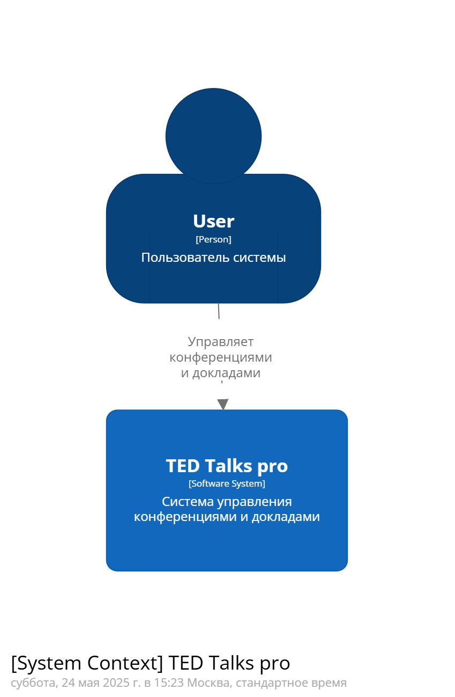
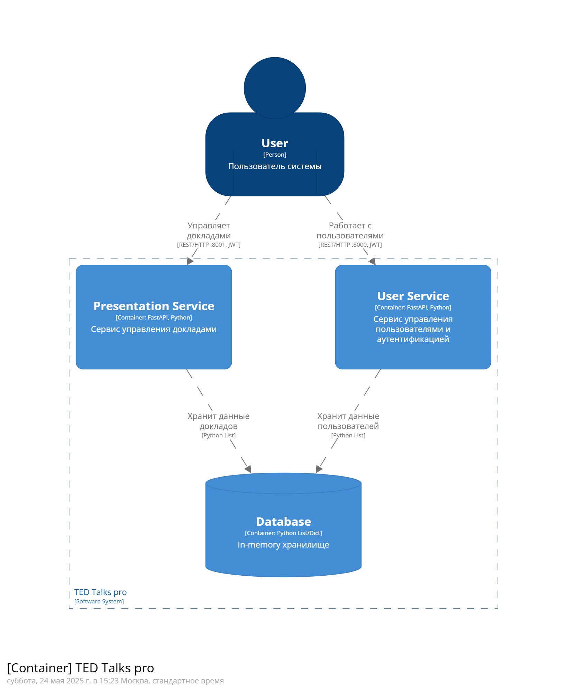
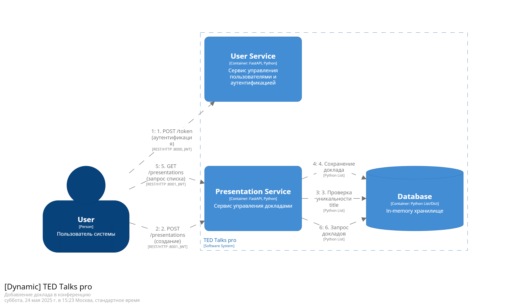

# Отчёт по выполнению задания 02

Речинская Ангелина М8О-106СВ-24 Вариант №3

## Задание

1. Создайте HTTP REST API для сервисов, спроектированных в первом задании (по проектированию). Должно быть реализовано как минимум два сервиса (управления пользователем, и хотя бы один «бизнес» сервис)
2. Сервис должен поддерживать аутентификацию с использованием JWT-token (Bearer)
3. Должен быть отдельный endpoint для получения токена по логину/паролю
4. Сервис должен реализовывать как минимум GET/POST методы
5. Данные сервиса должны храниться в памяти (базу данных добавим потом)
6. В целях проверки должен быть заведён мастер-пользователь (имя admin, пароль secret)
7. Сделайте OpenAPI спецификацию и сохраните ее в корне проекта
8. Актуализируйте модель архитектуры в Structurizr DSL
9. Ваши сервисы должны запускаться через docker-compose коммандой docker-compose up (создайте Docker файлы для каждого сервиса)

## Выполненные требования

### Реализация REST API
Реализованы два сервиса:
- **User Service** (порт 8000):
  - Управление пользователями (CRUD операции)
  - Аутентификация (JWT)
- **Presentation Service** (порт 8001):
  - Управление докладами (CRUD операции)

### Аутентификация с JWT
- Реализован endpoint `/token` для получения Bearer токена
- Все endpoint'ы требуют аутентификации
- Используется библиотека `python-jose` для работы с JWT

### Базовые HTTP методы
Для каждого сервиса реализованы:
```python
# User Service (порт 8000)
GET /users # Получение списка всех пользователей (требует аутентификации)
GET /users/{username} # Получение конкретного пользователя по username (требует аутентификации)
GET /users/search/{name_mask} # Поиск пользователей по части имени/фамилии (требует аутентификации)
POST /users # Создание нового пользователя (требует аутентификации)
PUT /users/{username} # Обновление данных пользователя (требует аутентификации)
DELETE /users/{username} # Удаление пользователя (требует аутентификации)

# Presentation Service (порт 8001)
GET /presentations # Получение списка всех докладов (требует аутентификации)
POST /presentations # Создание нового доклада (требует аутентификации)
PUT /presentations/{title} # Обновление доклада (требует аутентификации)
DELETE /presentations/{title} # Удаление доклада (требует аутентификации)
```

### OpenAPI спецификация
Сгенерирована автоматически FastAPI и сохранена в файлы:
- `./user_service/user_service.json` (`http://localhost:8000/openapi.json`)
- `./conference_service/conference_service.json` (`http://localhost:8001/openapi.json`)

### Обновленная архитектурная модель Structuriser DSL






