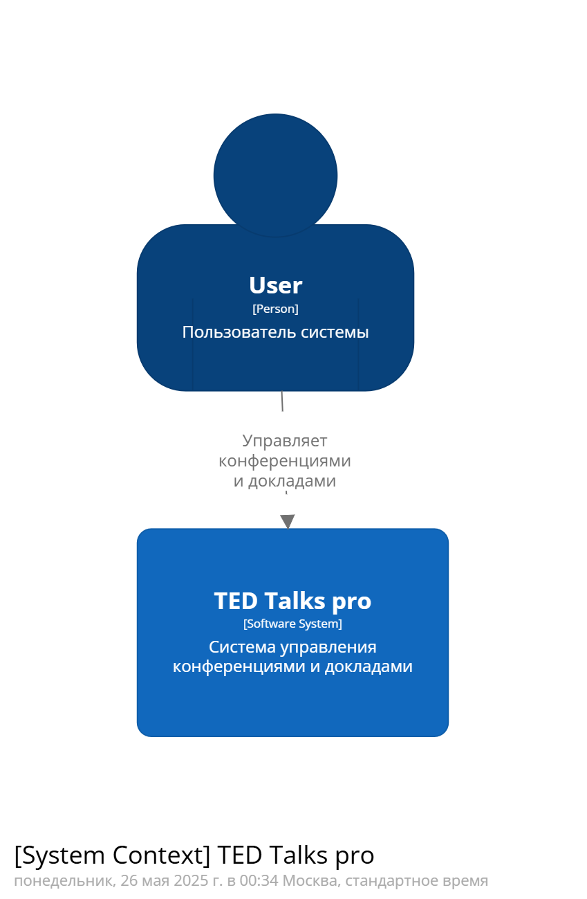
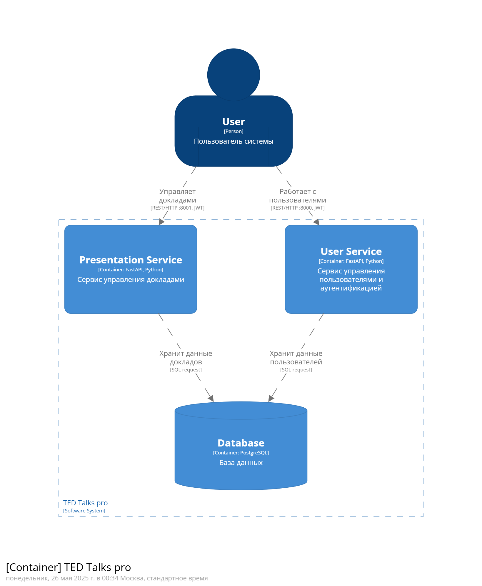
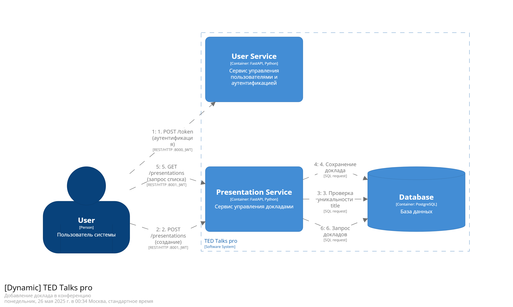

# Отчёт по лабораторной работе №3

Речинская Ангелина М8О-106СВ-24 Вариант №3

## Задание

1. Для сервиса управления данными (созданного в предыдущей лабораторной работе) о клиентах создайте долговременное хранилище данных в реляционной СУБД PostgreSQL 14;
2. Должен быть создан скрипт по созданию базы данных и таблиц, а также
наполнению СУБД тестовыми значениями. Он должен запускаться при первом
запуске вашего сервиса;
3. Для сущности, должны быть созданы запросы к БД (CRUD) согласно ранее
разработанной архитектуре
4. Данные о пользователе должны включать логин и пароль. Пароль должен
храниться в закрытом виде (хэширован) – в этом задании опционально
5. Должно применяться индексирования по полям, по которым будет
производиться поиск
6. При необходимости актуализируйте модель архитектуры в Structurizr DSL
7. Ваши сервисы должны запускаться через docker-compose командой docker
compose up (создайте Docker файлы для каждого сервиса)

## Выполненные задачи

### Создание долговременного хранилища в PostgreSQL
Реализована интеграция сервиса управления пользователями с PostgreSQL 14
Создана таблица `users` с полями:
```sql
CREATE TABLE IF NOT EXISTS users (
    id SERIAL PRIMARY KEY,
    username VARCHAR(50) UNIQUE NOT NULL,
    surname VARCHAR(100) NOT NULL,
    name VARCHAR(100) NOT NULL,
    patronymic VARCHAR(100),
    age INTEGER,
    email VARCHAR(100) NOT NULL,
    hashed_password VARCHAR(200) NOT NULL
);
```
```python
class DBUser(Base):
    __tablename__ = "users"

    id = Column(Integer, primary_key=True, index=True)
    username = Column(String(50), unique=True, index=True)
    surname = Column(String(100), index=True)
    name = Column(String(100), index=True)
    patronymic = Column(String(100), nullable=True)
    age = Column(Integer, nullable=True)
    email = Column(String(100))
    hashed_password = Column(String(200))
```

### Скрипт инициализации БД
Создан SQL-скрипт `init-db.sql` для:
  - Создания таблицы `users`
  - Добавления индексов для ускорения поиска:
  - Наполнения тестовыми данными (10^5 тестовых пользователя + admin)
- Скрипт автоматически выполняется при запуске контейнера PostgreSQL через volume:
  ```yaml
  volumes:
    - ./init-db.sql:/docker-entrypoint-initdb.d/init-db.sql
  ```

### 4. Безопасное хранение паролей
Реализовано хэширование паролей с использованием `passlib` (bcrypt)

Пароли хранятся в виде хэшей (пример: `$2b$12$EixZaYVK1fsbw1ZfbX3OXePaWxn96p36WQoeG6Lruj3vjPGga31lW`)

### 5. Индексация для поиска
Созданы индексы для часто используемых полей:
```sql
CREATE INDEX IF NOT EXISTS idx_users_username ON users(username);
CREATE INDEX IF NOT EXISTS idx_users_surname ON users(surname);
CREATE INDEX IF NOT EXISTS idx_users_name ON users(name);
CREATE INDEX IF NOT EXISTS idx_users_email ON users(email);
```

### Обновленная архитектурная модель Structuriser DSL






