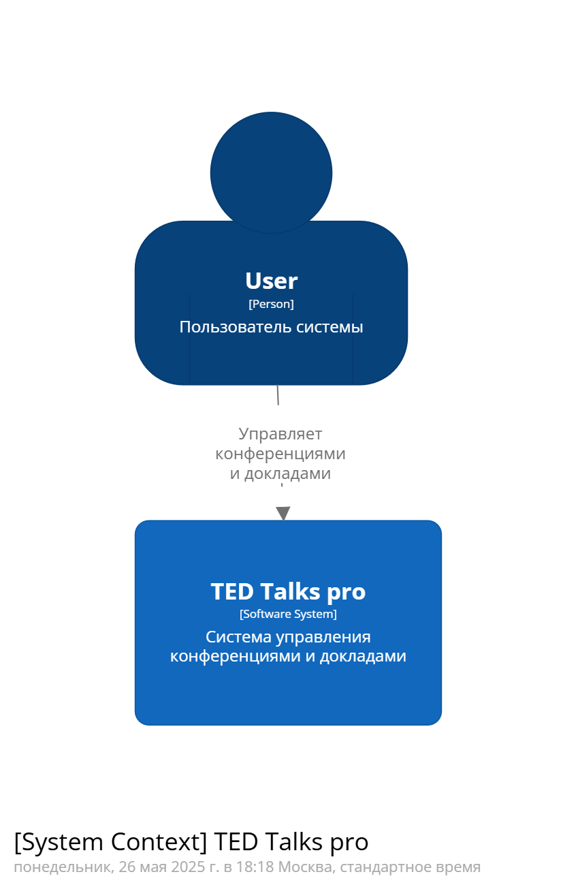
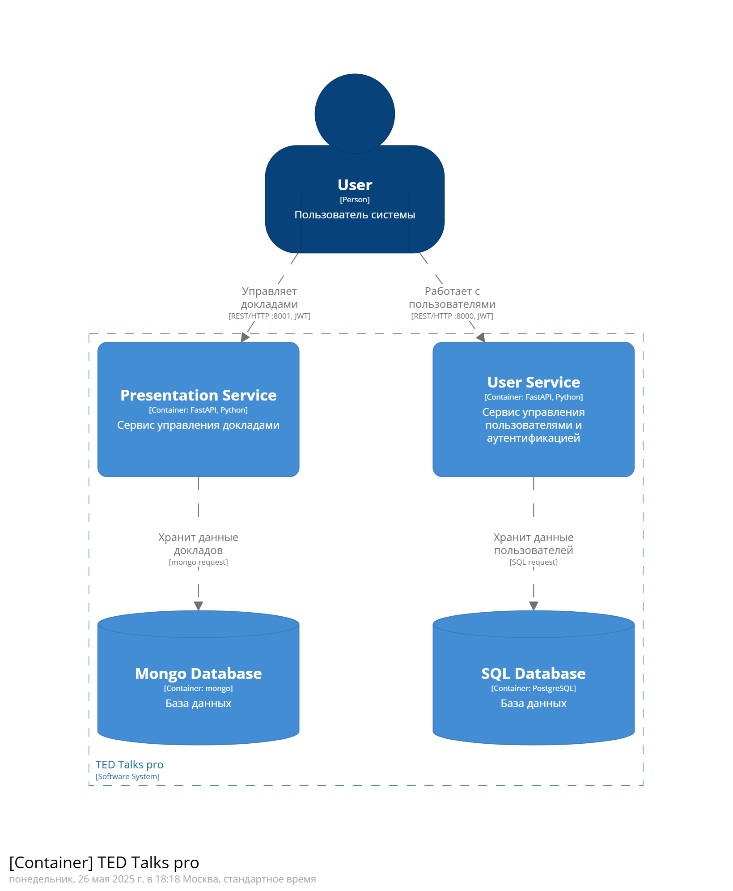
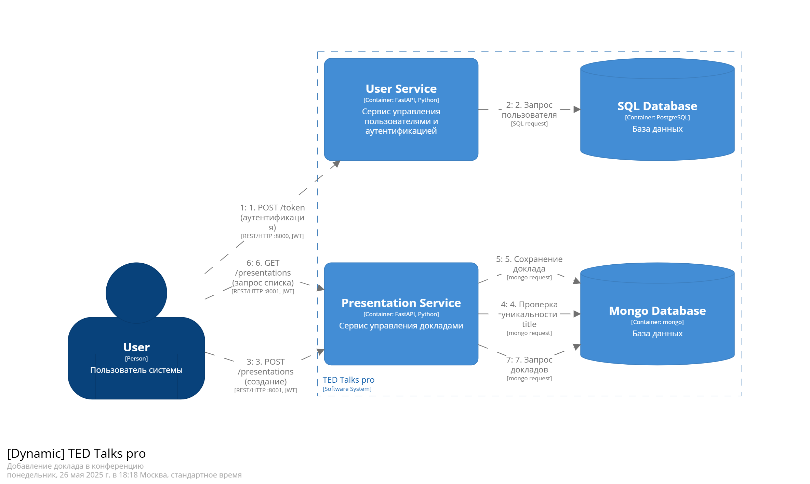

# Отчёт по лабораторной работе №4

Речинская Ангелина М8О-106СВ-24 Вариант №3

## Задание

1. Для сервиса управления данными (созданного в предыдущей Для одного сервиса управления данными (созданного в предыдущих
лабораторных работах) создайте долговременное хранилище данных в noSQL
базе данных MongoDB (4.0 или 5.0);
2. Выберете любой сервис, не связанный с клиентскими данными (клиентский
сервис остается в PostgreSQL). Например, данные о поездках, данные о планах,
данные о сообщениях ….
3. Должен быть создан скрипт по наполнению СУБД тестовыми значениями. Он
должен запускаться при первом запуске вашего сервиса;
4. Для сущности, должны быть созданы запросы к БД (CRUD) согласно ранее
разработанной архитектуре
5. Должны быть созданы индексы, ускоряющие запросы
6. Должно применяться индексирования по полям, по которым будет
производиться поиск
7. При необходимости актуализируйте модель архитектуры в Structurizr DSL
8. Ваши сервисы должны запускаться через docker-compose командой docker
compose up (создайте Docker файлы для каждого сервиса)

## Выполненные задачи

# Отчёт по лабораторной работе: Интеграция MongoDB в сервис управления докладами

## Выполненные задачи

### 1. Реализация NoSQL хранилища
Реализованы CRUD операции сервиса server (presentations) для хранения докладов с использованием noSQL базы данных - MongoDB

### Инициализация MongoDB
- Создан скрипт инициализации `mongo-init.js`:
  ```javascript
  db.createCollection('presentations');
  db.presentations.createIndex({ "title": 1 }, { unique: true });
  db.presentations.insertMany([...]);
  ```
- Скрипт автоматически выполняется при первом запуске через volume:
  ```yaml
  volumes:
    - ./mongo-init.js:/docker-entrypoint-initdb.d/mongo-init.js:ro
  ```


### Индексация для производительности
Создан уникальный индекс по полю `title` для обеспечения уникальности названий. Индекс автоматически создается при инициализации БД

### Docker-конфигурация
Обновлен `docker-compose.yml` с сервисом MongoDB:
  ```yaml
  mongo:
    image: mongo:5.0
    volumes:
      - mongo-data:/data/db
      - ./mongo-init.js:/docker-entrypoint-initdb.d/mongo-init.js:ro
    healthcheck:
      test: echo 'db.runCommand("ping").ok' | mongosh localhost:27017/test --quiet
  ```
Настроены healthcheck для обоих СУБД


### Обновленная архитектурная модель Structuriser DSL






