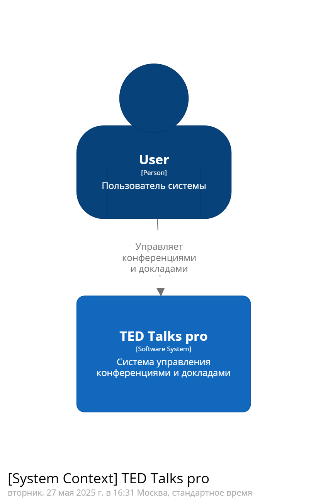
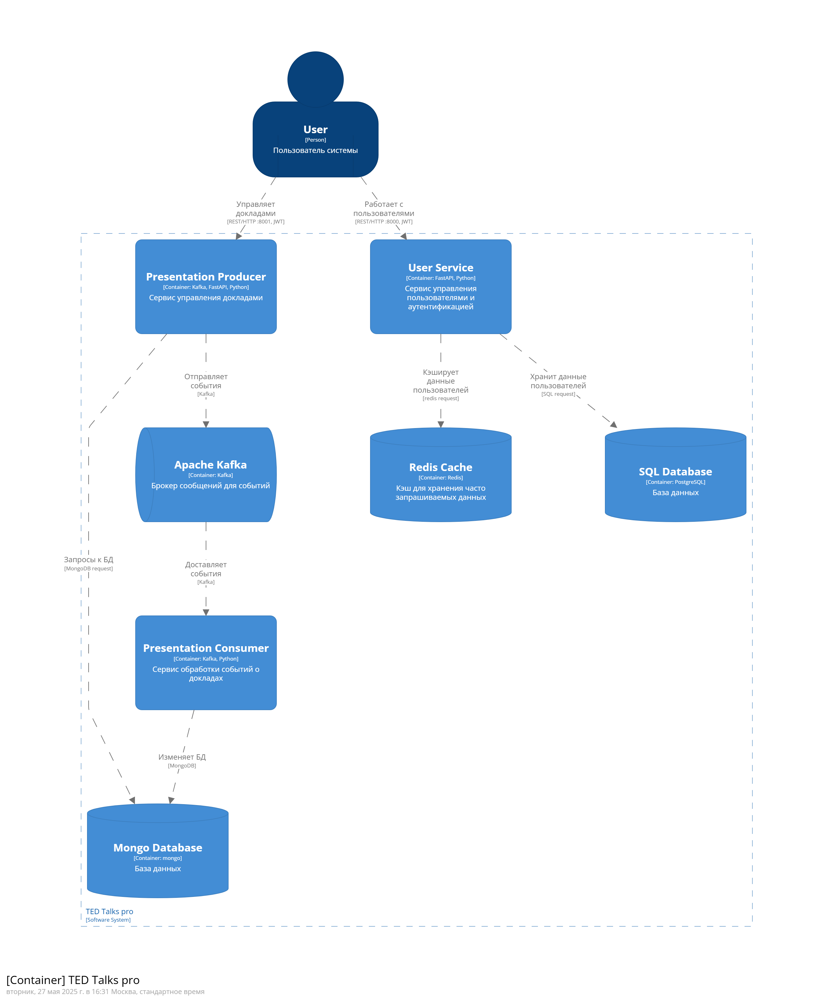
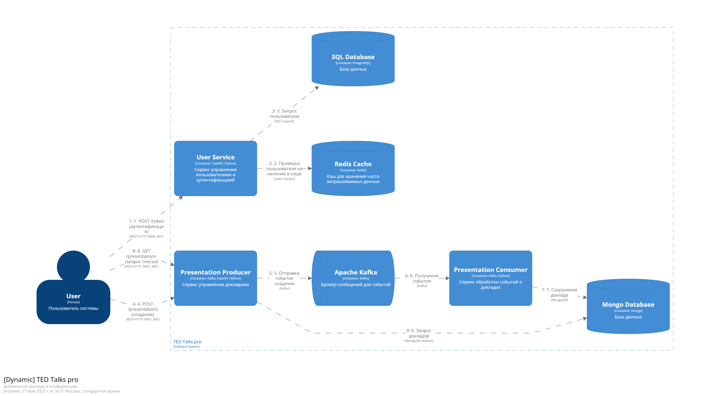

# Отчёт по лабораторной работе №6

Речинская Ангелина М8О-106СВ-24 Вариант №3

## Задание

1. Реализуйте для добавления одной из сущностей вашего задания паттерн CQRS:

    a. сервис вместо записи в базу данных должен сохранять сообщение в topic
kafka (допускается одновременное сохранение сущности в кеш Redis –
шаблон сквозная-запись)

    b. реализуйте отдельный контейнер, который считывает сообщения из
topic kafka и сохраняет их в базу данных

2. Актуализируйте модель архитектуры в Structurizr DSL
3. Ваши сервисы должны запускаться через docker-compose командой docker
compose up (создайте Docker файлы для каждого сервиса)

## Выполненные задачи

### Архитектурное решение

Для сущности "Доклад" реализована следующая схема:

Presentation Producer (команды):
  - Принимает HTTP-запросы на создание/обновление/удаление докладов
  - Валидирует данные
  - Отправляет события в Kafka вместо прямого изменения БД
  - Возвращает результат клиенту

Presentation Consumer (обработчик событий):

  - Считывает события из Kafka
  - Применяет изменения к MongoDB
  - Обеспечивает eventual consistency

### Сервисы в docker-compose (сокращенный вариант)

```yaml
services:
  presentation_producer:
    build: ./presentation_producer
    ports: ["8001:8000"]
    depends_on: [kafka1, kafka2]

  presentation_consumer:
    build: ./presentation_consumer
    depends_on: [kafka1, kafka2]

  kafka1:
    image: bitnami/kafka:latest
    ports: ["9092:9092"]

  kafka2:
    image: bitnami/kafka:latest

  mongo:
    image: mongo:5.0
    ports: ["27017:27017"]
```

### Dockerfile для Producer

```dockerfile
FROM python:3.11-slim
WORKDIR /workspace
COPY requirements.txt .
RUN pip install -r requirements.txt
COPY . .
EXPOSE 8000
CMD ["python", "presentation_producer.py"]
```

### Dockerfile для Consumer

```dockerfile
FROM python:3.11-slim
WORKDIR /workspace
COPY requirements.txt .
RUN pip install -r requirements.txt
COPY . .
CMD ["python", "presentation_consumer.py"]
```


### Обновленная архитектурная модель Structuriser DSL






